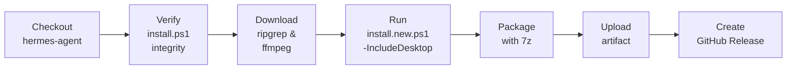

# Hermes Agent Windows Packer

A GitHub Actions workflow repository for packaging the [Hermes Agent](https://github.com/shineeagle/hermes-agent) into a ready-to-use Windows archive.

The workflow clones the Hermes Agent repo, verifies `install.ps1` integrity against the official distribution, downloads portable tools (ripgrep, ffmpeg), runs the installer with desktop support, and packages everything into a single `.7z` archive that users can extract and run immediately.

---

## Table of Contents

- [How It Works](#how-it-works)
- [Directory Structure](#directory-structure)
- [Usage](#usage)
  - [Automatic Builds](#automatic-builds)
  - [Manual Trigger](#manual-trigger)
  - [Using the Package](#using-the-package)
- [Files](#files)
- [Customization](#customization)

---

## How It Works



1. **Checkout** — Clones the hermes-agent repository (supports branch/tag selection via `workflow_dispatch`).
2. **Integrity check** — Downloads the official `install.ps1` from `hermes-agent.nousresearch.com` and compares its SHA-256 hash against the repo copy. Fails the build on mismatch.
3. **Download tools** — Fetches the latest ripgrep and ffmpeg releases from GitHub and places them under `hermes/tools/`.
4. **Install** — Runs `install.new.ps1 -IncludeDesktop` which provisions Python, Git, Node.js, creates a venv, installs all dependencies, and builds the Electron desktop app.
5. **Package** — Compresses the entire `hermes/` directory into a `.7z` archive with maximum compression.
6. **Release** — Uploads the artifact and creates a GitHub Release (on `main` branch pushes only).

---

## Directory Structure

### This Repository (Source)

```
hermers_agent_windows_packer/
├── .github/
│   └── workflows/
│       └── package.yml          # CI workflow definition
├── hermes-launch.ps1            # Launcher script (included in the package)
├── install.new.ps1              # Latest installer script (hash-verified)
├── install.ps1                  # Original installer script
└── README.md
```

### Built Package (after extraction)

```
$HERMES_HOME/hermes/
├── hermes-launch.ps1            # Launches Hermes GUI with correct PATH
├── tools/
│   ├── ripgrep/                 # Portable ripgrep (rg.exe)
│   └── ffmpeg/                  # Portable ffmpeg (ffmpeg.exe)
│
└── hermes-agent/                # Full Hermes installation
    ├── .hermes-bootstrap-complete
    ├── hermes_cli/              # Python CLI package
    ├── venv/
    │   └── Scripts/
    │       ├── hermes.exe       # CLI launcher (hermes <command>)
    │       └── python.exe       # Managed Python interpreter
    ├── apps/
    │   └── desktop/
    │       └── release/
    │           └── win-unpacked/
    │               └── Hermes.exe   # ← Desktop GUI application
    ├── node_modules/            # Browser tools dependencies
    ├── skills/                  # Bundled AI skill definitions
    └── tools/
        └── skills_sync.py       # Skill synchronization script

$HERMES_HOME\hermes\           # HERMES_HOME (user data)
├── .env                         # API keys, model configuration
├── SOUL.md                      # AI personality prompt
├── skills/                      # Synced skills
└── whatsapp/                    # WhatsApp integration data
```

---

## Usage

### Automatic Builds

The workflow runs automatically on:
- **Push** to `main` — builds and publishes a release
- **Pull request** to `main` — builds and uploads an artifact for review

### Manual Trigger

Go to **Actions → Build and Release Hermes Agent → Run workflow**:

| Input | Description | Default |
|-------|-------------|---------|
| `hermes_branch` | Branch of hermes-agent to build | `main` |
| `hermes_tag` | Tag to build (overrides branch) | *(empty)* |

### Using the Package

1. Download the latest release from the [Releases page](https://github.com/shineeagle/hermers_agent_windows_packer/releases).
2. Extract the `.7z` archive to your preferred location (e.g. `C:\Hermes`).
3. Run `hermes-launch.ps1` — it opens a new PowerShell window with all tools on `PATH` and launches the Hermes desktop GUI.
---

## Files

| File | Purpose |
|------|---------|
| `package.yml` | GitHub Actions workflow — defines the full build pipeline |
| `hermes-launch.ps1` | Portable launcher — sets up PATH and starts the Hermes GUI |

---

## Customization

### Adding More Tools

Edit [**Step 4**](https://github.com/ShinyEagle/hermers_agent_windows_packer/blob/main/.github/workflows/package.yml#L166:L202) in `package.yml` to download additional portable tools:

```yaml
# Example: adding a new tool
$toolRelease = Invoke-RestMethod -Uri "https://api.github.com/repos/OWNER/REPO/releases/latest"
$toolAsset = $toolRelease.assets | Where-Object { $_.name -match "PATTERN" }
Invoke-WebRequest -Uri $toolAsset.browser_download_url -OutFile "tool.zip"
Expand-Archive -Path "tool.zip" -DestinationPath "$ToolsDir\tool" -Force
```

The tool will be automatically available in the launched PowerShell session since `hermes-launch.ps1` adds all `tools\*` subdirectories to `PATH`.